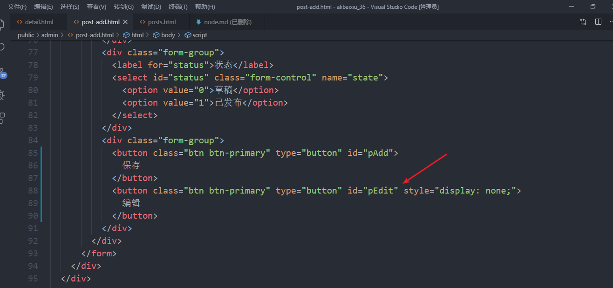

## 文章的编辑功能
- 找到post.html 找到编辑按钮 给其添加一个a标签的链接地址 

  
```javascript
<script type="text/html" id="pTpl">
    {{each records}}
    <tr>
        <td>{{$value.title}}</td>
        <td>{{$value.author.nickName}}</td>
        <td>{{$value.category.title}}</td>
        <td class="text-center">{{$value.createAt && $value.createAt.substr(0,10)}}</td>
        <td class="text-center">{{$value.state == 1 ? '已发布' : '草稿'}}</td>
        <td class="text-center">
          <a href="post-add.html?id={{$value._id}}" class="btn btn-default btn-xs ">编辑</a>
          <a href="javascript:;" class="btn btn-danger btn-xs delete" data-id="{{$value._id}}">删除</a>
        </td>
      </tr>
    {{/each}}
  
  </script>
```
- 需要回到post-add.html页面上 本身是完成的文章添加功能  修改功能 
判断当前的url地址栏里面是否有id参数  如果有 表示是修改功能  
```javascript
// 从浏览器的地址栏中获取查询参数
      function getUrlParams(name) {
        var paramsAry = location.search.substr(1).split("&");
        // 循环数据
        for (var i = 0; i < paramsAry.length; i++) {
          var tmp = paramsAry[i].split("=");
          if (tmp[0] == name) {
            return tmp[1];
          }
        }
        return -1;
      }
```



- 如何知道用户是添加文章 还是修改文章  getUrlParams('id') != -1 就表示是修改文章 功能  
- 需要显示对应的分类效果  
 要获取到所有的option里面的value属性值  然后拿这个值与后台给我们的分类id进行比较  如果相等 给当前的这个option添加selected  
 我们通过jQuery的选择器将所有的Option获取到 
 $('#category > option')

